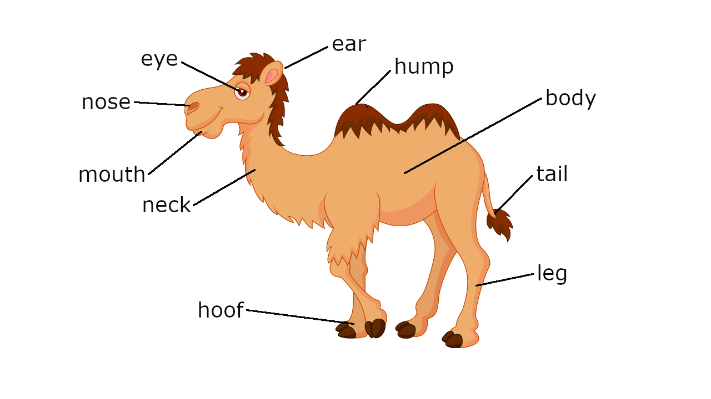
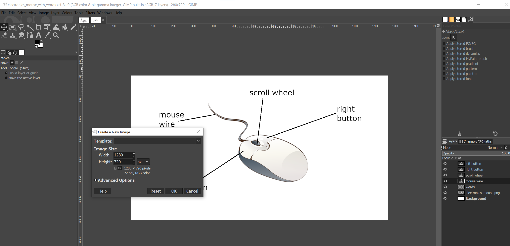

# nouns-kingdom

## Project setup
```
npm install
```

### Compiles and hot-reloads for development
```
npm run serve
```

### Compiles and minifies for production
```
npm run build
```

### Run your unit tests
```
npm run test:unit
```

### Lints and fixes files
```
npm run lint
```

### Customize configuration
See [Configuration Reference](https://cli.vuejs.org/config/).

---
---
## how to contribute to this project
### Add a new category (you can skill this part if you add a card in an existing category)
Suppose you want to add a new category. You need to add it in file "nouns-kingdom\public\db_category.JSON". Please use lower cases.
```
{
  "category": [
    "animals",
    "foods",
    "fruits",
    "vegetables",
    "drinks",
    "plants", 
    "flowers",
    "clothes",
    "transportations",
    "kitchen",
    "electronics",
    "furniture",
    "new category" <--- this is the new category>
  ]
}
```
You also need to add a picture (new category.png) under "nouns-kingdom\src\assets\category", with the same category name you just added in file "db_category.JSON". The new category will be picked up and showed under the home page automatically.

### Add cards in an existing category
You need to have two images ready for this part. The first picture's name format is "<categoryName>_<cardName>.png". The second one's name is ",<categoryName>_<cardName>_with_words.png". You need to put both images under path "nouns-kingdom\src\assets". You also need to update the "category_file.JSON" under public path.

E.g. You want to add a camel card under animals category.
images:
1. animals_camel.png
1. animals_camel_with_words.png



You also need to update file "nouns-kingdom\public\db_animals.JSON".
```
    "camel": {
        "ear": "耳朵",
        "eye": "眼睛",
        "nose": "鼻子",
        "mouth": "嘴巴",
        "neck": "脖子",
        "leg": "腿",
        "hoof": "蹄子",
        "tail": "尾巴",
        "body": "身体",
        "hump": "驼峰"
    },
```
You can now start the project and see the cards you just added. It will be showed on screen automatically.


---
Image editing software:
I use windows 10, and install GIMP to add words to a picture.
when you create a new image, choose template: 1280 * 720 px. Font size: 38px.


how to change image size: drag and drop the image in the new created template, shift + s


add new layer and add all words and lines in the new added layer.


Please also keep a copy of the file as .xcf format, so you can update the details later. (in case you find any typo in the png file, you can update it easily in .xcf).